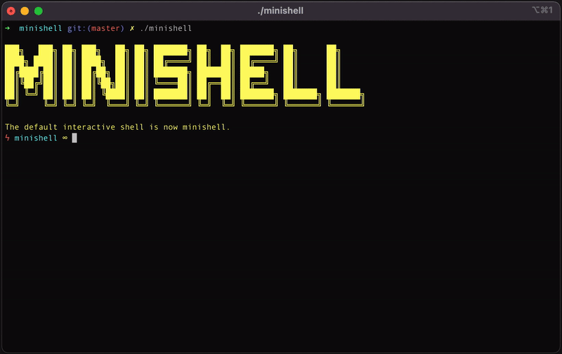

# minishell



## Description

A Shell provides you with an interface to the Unix system. It gathers input from you and executes programs based on that input. When a program finishes executing, it displays that program's output.

Shell is an environment in which we can run our commands, programs, and shell scripts. There are different flavors of a shell, just as there are different flavors of operating systems. Each flavor of shell has its own set of recognized commands and functions.

And **minishell** is my interpretation of the legendary [shell](https://en.wikipedia.org/wiki/Shell_(computing)).

## Features
### Basics:
+ Search and launch the right executable (based on the PATH variable, using a relative or an absolute path)
+ Environment variables ($ followed by a sequence of characters) expand to their values
+ ```’``` (single quotes - prevent from interpreting meta-characters in quoted sequence)
+ ```"``` (double quotes - prevent from interpreting meta-characters in quoted sequence except for $)
+ ```|``` connect cmds or groups with pipes; output of a cmd is connected to the input of the next cmd via a pipe

### Redirections:
+ ```< file``` Redirecting Input
+ ```<<limiter``` Here Documents
+ ```> file``` Redirecting Output
+ ```>> file``` Appending Redirected Output

### Builtins:
- ```echo``` with option -n
- ```cd``` with relative/absolute path
- ```pwd``` without options
- ```env``` without options
- ```unset [env]``` without options
- ```exit [exit_status]``` without options

## Usage
### Installation Instructions
1. Cloning this repository
    ```commandline
    git clone --recurse-submodules https://github.com/Kllaster/minishell.git
    ```

2. `cd` into the root directory
    ```commandline
    cd minishell
    ```

3. Creating a program from source code
    ```commandline
    make
    ```

### One-line installation
```commandline
git clone --recurse-submodules https://github.com/Kllaster/minishell.git\
&& cd minishell\
&& make
```

### Running the program
```commandline
./minishell
```
